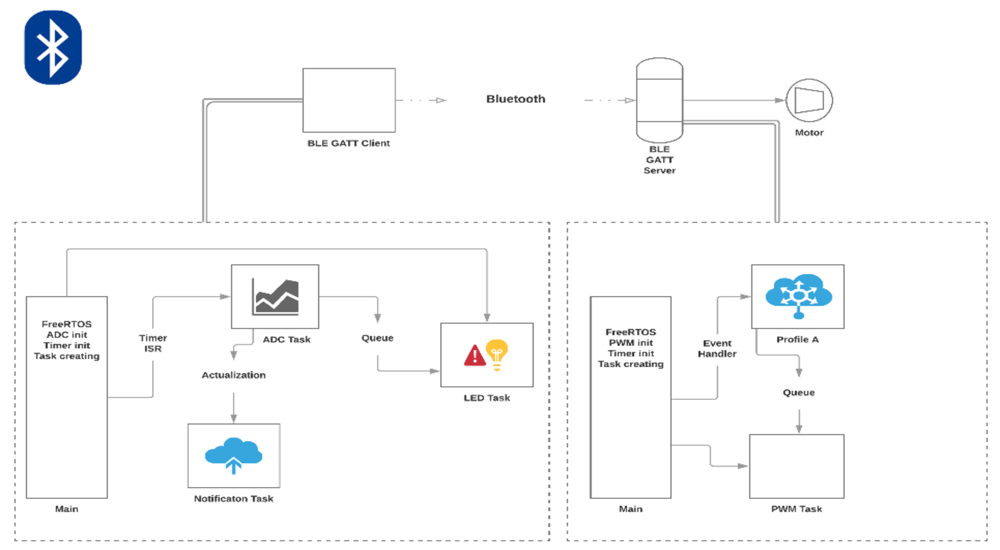

# PROJECT_v2.0

Wireless, actionless lightning control.

## Lightning Control

This devices (2 bluetooth BLE dev.) are able to control lightning system in room. 
Project contain soft for 2 bluetooth devices which working with morion sensor -> both of them have own sensor.
Client and Server topology, 
* Server -> peripheral with sensor, 
* Client -> central actuator.  

## Why actionless?

The light is conntroled only by BLE devices, there is no switches, neither lamps aren't controlled manualy. Every noticed triger will activate relevant function (eg Lights ON).

# PROJECT_v1.0
## Motor Control 

Wireless DC motor control.

### Getting Started

Project involve DC motor control via Bluetooth 4.2, it contains BLE GATT Server - broadcast station and BLE GATT Client - motor control unit. This repository include software for 
BLE modules. Project consist of following parts:

* Broadcast Station - which include ESP 32 (BLE Client - central). 
* Motor Control Unit (MtCU) - which include ESP 32 (BLE Server - peripheral).

### How it works
#### System initialization 

Configuration whole system, no connection yet. 

#### Connecting...

Start scanning for the BLE devices, blinking LEDs.

#### Scanning result

In this case, we have 2 options:

* All devices connected - 2 BLE servers are connected;
* Timeout - if Client will not find the servers after 30s from system inicialization -> delay, soft reset.

#### Let's play

If All devices are connected -> connected status on LEDs.

The central unit (BLE Client) reacts to notifications from the BLE Server. We have 4 options :

* Start - BLE Server send start request -> MtCU accelerates the motor in 20s period.
* Stop - BLE Client send stop request -> MtCU breaking the motor in 15s period.
* Immediate stop - BLE Client send immediate request -> MtCU break the motor.
* Speed control - BLE Client sending notifications regarding motor speed.

If BLE connection between BLE devices will break down, the motor will be stopped.

#### Project diagram

### Software

Project based on FreeRT Operation System write in C. The code combines own ideas and espressif support.

### Hardware

#### ESP 32

Wifi/Bluetooth module based on Xtensa® single-/dual-core 32-bit microprocessor. In this case used ESP32-DevKitC.

>ESP32 can perform as a complete standalone system or as a slave device to a host MCU, 
>reducing communication stack overhead on the main application processor. 
>ESP32 can interface with other systems to provide Wi-Fi and Bluetooth functionality 
>through its SPI / SDIO or I2C / UART interfaces.

-note from Espressif site.

